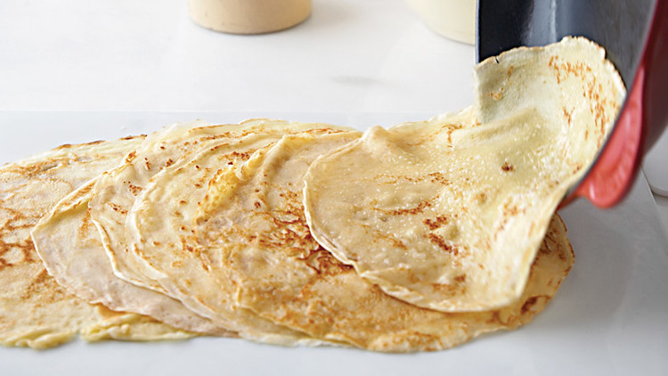

This is my first post on my new blog! How exciting!

I'm sure I'll write a lot more interesting things in the future.

Oh, and here's a great quote from Wikipedia on
[crepes](https://en.wikipedia.org/wiki/Cr%C3%AApe).

> A crêpe or crepe is a type of very thin pancake. Crêpes are usually of two
> types: sweet crêpes (crêpes sucrées) and savoury galettes (crêpes salées).
> Crêpes are served with a variety of fillings, from the simplest with only
> sugar to flambéed crêpes Suzette or elaborate savoury galettes. While crêpes
> are often associated with Brittany, a region in the northwest of France, their
> consumption is widespread in France, Belgium, Canada, and many parts of
> Europe, North Africa, Lebanon, and the Southern Cone of South America.

